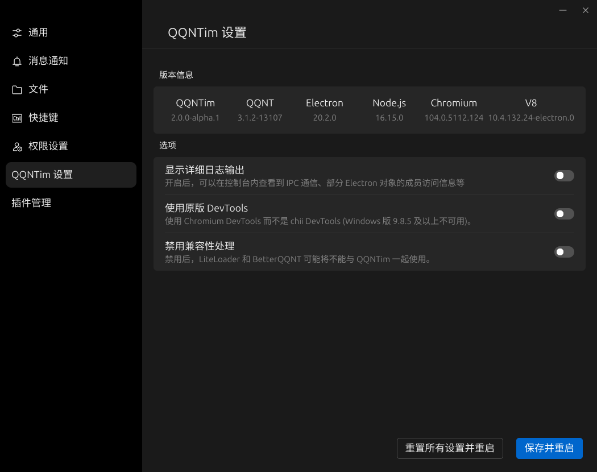

# 使用手册

此文档包含了使用教程。

## 已知支持的 QQNT 版本

| 操作系统 | 最高版本 | 最低版本 |
| -------- | -------- | -------- |
| Windows  | 9.9.1    | 9.8.0    |
| Linux    | 3.1.2    | 3.0.0    |
| macOS    | 6.9.17 (12118)     | 6.9.12 (10951)     |

## 安装

**请务必仔细阅读本章节内容以避免不必要的麻烦！**

QQNTim 支持 LiteLoader，但**不支持 BetterQQNT**。

> ### LiteLoader 相关安装教程：
>
> #### 如果你已经安装了 LiteLoader，想安装 QQNTim：
>
> 1. **确保 LiteLoader 文件夹名称为 `LiteLoader` 或 `LiteLoaderQQNT`。否则 LiteLoader 将不会被加载！**
>
> 2. 到 `QQNT 根目录/resources/app` 下修改 `package.json`，将 `"LiteLoader"` 修改为 `"./app_launcher/index.js"`，之后再运行 QQNTim 的安装脚本即可。
>
> #### 如果你已经安装了 QQNTim，想安装 LiteLoader：
>
> 请遵循 [LiteLoader 官方安装教程](https://github.com/mo-jinran/LiteLoaderQQNT/blob/main/README.md#安装方法) 进行安装即可，但请注意以下两点：
>
> 1. **确保 LiteLoader 文件夹名称为 `LiteLoader` 或 `LiteLoaderQQNT`。否则 LiteLoader 将不会被加载！**
>
> 2. **不要按照教程中的方法修改 `package.json`！否则 QQNTim 将不会加载。你只需保持它原样即可。**

安装前请确保电脑上已经安装了 QQNT。

如果你正在使用的是 **[不支持的 QQNT 版本](#已知支持的-qqnt-版本)、发现 QQNTim 无法正常使用且希望申请适配**，请通过 [附录-显示终端日志](#显示终端日志) 中提供的方法收集日志，并[向我们**提交此问题**](https://github.com/Flysoft-Studio/QQNTim/issues)。

请先从 [Releases](https://github.com/Flysoft-Studio/QQNTim/releases) 中下载最新的版本（对于一般用户，建议下载 `qqntim-build.zip`），下载后，请确保你**解压了所有文件（必须包含 `_` 文件夹）**！

在 Windows 下，请运行 `install.cmd` 安装或运行 `uninstall.cmd` 卸载。

在 Linux 下，请在安装文件夹下运行：

```bash
# 安装
chmod +x ./install.sh
./install.sh
# 卸载
chmod +x ./uninstall.sh
./uninstall.sh
```
在 macOS 下，请运行 `install_macos.sh` 安装或运行 `uninstall_macos.sh` 卸载。
需要输入管理员密码鉴权，同时在弹出的通知中选择允许终端修改App，或前往 `系统设置->隐私与安全性->App管理` 中打开/添加 `终端` 来允许终端修改文件。

安装后，打开 "设置" 页面：


如果左侧菜单出现 "QQNTim 设置"，即代表安装成功：



如果此项目并未按预期出现，则可能代表 QQNTim 安装没有成功，或 QQNTim 加载失败。请通过 [附录-显示终端日志](#显示终端日志) 中提供的方法收集日志，并[向我们**提交此问题**](https://github.com/Flysoft-Studio/QQNTim/issues)。

## 插件管理

### 获取插件

**[Plugins Galaxy](https://github.com/FlysoftBeta/QQNTim-Plugins-Galaxy) 中拥有很多功能丰富的插件，欢迎下载。**

支持 QQNTim 3.0 及以上版本的插件：

| 名称                                                                                                     | 说明                                          | 作者                                         |
| -------------------------------------------------------------------------------------------------------- | --------------------------------------------- | -------------------------------------------- |
| [QQNTim-Plugin-Markdown](https://github.com/Flysoft-Studio/QQNTim-Plugin-Markdown)                       | 显示 Markdown 消息/LaTeX 渲染插件             | [Flysoft](https://github.com/Flysoft-Studio) |
| [QQNTim-Plugin-No-Revoked-Messages](https://github.com/Flysoft-Studio/QQNTim-Plugin-No-Revoked-Messages) | 支持消息持久化保存的防撤回插件                | [Flysoft](https://github.com/Flysoft-Studio) |
| [QQNTim-Plugins-Galaxy](https://github.com/FlysoftBeta/QQNTim-Plugins-Galaxy)                            | 插件商城（注意：只有壁纸插件支持 QQNTim 3.0） | [Flysoft](https://github.com/Flysoft-Studio) |

仅支持 QQNTim 2.2 及以下版本的插件：

| 名称                                                                          | 说明                                                   | 作者                                         |
| ----------------------------------------------------------------------------- | ------------------------------------------------------ | -------------------------------------------- |
| [QQNTim-Plugin-NTHttp](https://github.com/Rei1mu/QQNTim-Plugin-NTHttp)        | WebSocket+Http 的通信实现                              | [Rei1mu](https://github.com/Rei1mu)          |
| [QQNTim-Plugin-NoUpdate](https://github.com/Rei1mu/QQNTim-Plugin-NoUpdate)    | 取消提示自动更新的烦人弹窗                             | [Rei1mu](https://github.com/Rei1mu)          |
| [QQNTim-Plugins-Galaxy](https://github.com/FlysoftBeta/QQNTim-Plugins-Galaxy) | 插件商城（注意：壁纸插件不支持 QQNTim 2.2 及以下版本） | [Flysoft](https://github.com/Flysoft-Studio) |

### 安装插件

要安装插件，请准备一个插件**压缩包 (.zip) 或文件夹**。

结构如下图所示（每个插件结构各不相同，这里提供的结构图仅供参考）：

```
我的插件
  ├─ qqntim.json
  ├─ renderer.js
  ├─ style.css
  └─ ...
```

打开 "设置" 页面，选中 "插件管理"：


如果你登录了多个 QQ 账户，且希望某个插件只对当前账户生效，那么请点击 "仅对账号 [你的 QQ 号] 生效的插件" 右侧的安装按钮。

如果你希望插件对所有账户生效，那么请点击 "对所有账号生效的插件" 右侧的安装按钮进行安装。

**_注意：根据提示选择插件相关文件安装后，你可能需要重启 QQ 才能使这些插件开始生效。_**

安装插件后，如果插件没有按预期正常工作，请通过 [附录-显示终端日志](#显示终端日志) 中提供的方法收集日志，并向插件作者提交此问题。

### 管理现有插件

打开 "设置" 页面，选中 "插件管理"：


目前，你可以启用、禁用或删除插件。

**_注意：修改设置之后需要点击 "保存并重启" 才能使设置生效。_**

## 数据文件夹

数据文件夹存放了所有插件和设置。

在 Windows 下，默认数据文件夹位于 `%UserProfile%/.qqntim`（例如：`C:/Users/[你的用户名]/.qqntim`）。

在 Linux 下，默认数据文件夹位于 `$HOME/.local/share/QQNTim`（例如：`/home/[你的用户名]/.local/share/QQNTim`，可能需要启用**显示隐藏文件**选项才能显示出来）。

你可以修改 `QQNTIM_HOME` 环境变量以修改数据文件夹的位置。

## 附录

### 显示终端日志

#### 在 Windows 下显示终端日志

1. 桌面右键 QQ 图标，点击 "打开文件所在位置"。
2. 在出现的文件夹窗口内按住 `Shift` 右键，点击 "在此处打开命令窗口" 或 "在此处打开 PowerShell 窗口"。
3. 在弹出的控制台窗口内输入 ".\QQ.exe" 并按下 `Enter`。
4. 日志信息将会出现在控制台窗口内。

#### 在 GNOME (Linux) 下显示终端日志

1. 按两次 `Super` 键，打开 "所有应用"。
2. 输入 "终端"，并按下 `Enter`。
3. 在弹出的控制台窗口内输入 "linuxqq ; qq" 并按下 `Enter`。
4. 日志信息将会出现在控制台窗口内。

#### 在 KDE (Linux) 下显示终端日志

1. 按一次次 `Super` 键，打开 "KDE 菜单"。
2. 输入 "Konsole"，并按下 `Enter`。
3. 在弹出的控制台窗口内输入 "linuxqq ; qq" 并按下 `Enter`。
4. 日志信息将会出现在控制台窗口内。
