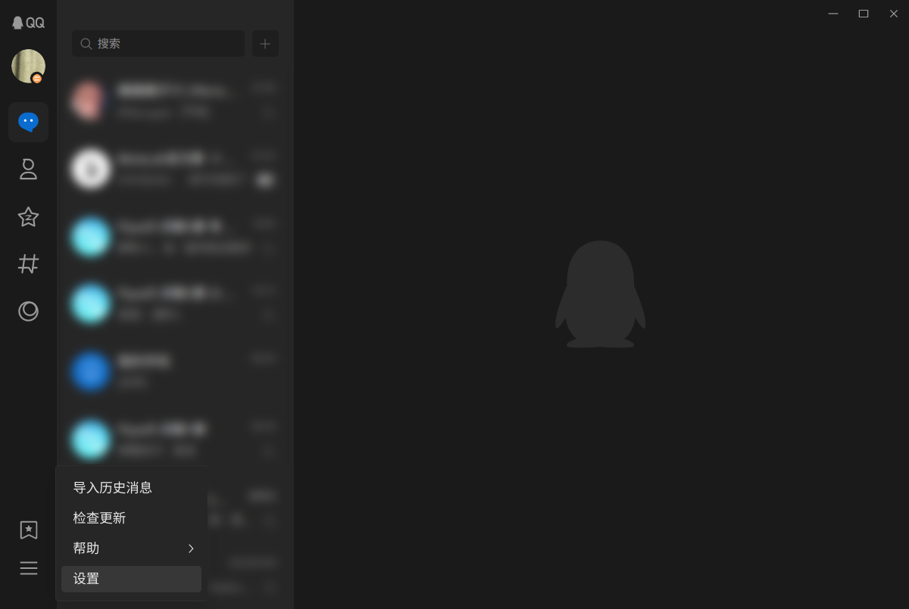

# 使用手册

此文档包含了使用教程。

## 安装

> 致 LiteLoader 用户：
>
> 如果你希望同时使用 LiteLoader 和 QQNTim，
> 请先遵循 LiteLoader 的 [安装步骤](https://github.com/mo-jinran/LiteLoaderQQNT/tree/main#%E5%AE%89%E8%A3%85%E6%96%B9%E6%B3%95) 进行安装，
> **LiteLoader 文件夹名称必须为 `LiteLoader`，并*跳过*第二步**：
>
> > _2. 编辑安装位置/package.json 文件，将 main 键值改为 LiteLoader（根据文件夹名字而修改）_
>
> 之后再运行 QQNTim 的安装脚本即可。

安装前请确保电脑上已经安装了 QQNT。

在 Windows 下，请运行 `install.cmd` 安装或运行 `uninstall.cmd` 卸载。

在 Linux 下，请在安装文件夹下运行：

```bash
# 安装
chmod +x ./install.sh
./install.sh
# 卸载
chmod +x ./uninstall.sh
./uninstall.sh
```

安装后，打开 "设置" 页面：



如果左侧菜单出现 "QQNTim 设置"，即代表安装成功：


如果此项目并未按预期出现，则可能代表 QQNTim 安装没有成功，或 QQNTim 加载失败。请通过 [附录-显示终端日志](#显示终端日志) 中提供的方法收集日志，并[向我们**提交此问题**](https://github.com/Flysoft-Studio/QQNTim/issues)。

## 插件管理

### 获取插件

**[Plugins Galaxy](https://github.com/FlysoftBeta/QQNTim-Plugins-Galaxy) 中拥有很多功能丰富的插件，欢迎下载。**

还有一些其他的插件：

| 名称                                                                       | 说明                       | 作者                                |
| -------------------------------------------------------------------------- | -------------------------- | ----------------------------------- |
| [QQNTim-Plugin-NTHttp](https://github.com/Rei1mu/QQNTim-Plugin-NTHttp)     | WebSocket+Http 的通信实现  | [Rei1mu](https://github.com/Rei1mu) |
| [QQNTim-Plugin-NoUpdate](https://github.com/Rei1mu/QQNTim-Plugin-NoUpdate) | 取消提示自动更新的烦人弹窗 | [Rei1mu](https://github.com/Rei1mu) |

### 安装插件

要安装插件，请准备一个插件**压缩包 (.zip) 或文件夹**。

结构如下图所示（每个插件结构各不相同，这里提供的结构图仅供参考）：

```
我的插件
  ├─ qqntim.json
  ├─ renderer.js
  ├─ style.css
  └─ ...
```

打开 "设置" 页面，选中 "插件管理"：


如果你登录了多个 QQ 账户，且希望某个插件只对当前账户生效，那么请点击 "仅对账号 [你的 QQ 号] 生效的插件" 右侧的安装按钮。

如果你希望插件对所有账户生效，那么请点击 "对所有账号生效的插件" 右侧的安装按钮进行安装。

**_注意：根据提示选择插件相关文件安装后，你可能需要重启 QQ 才能使这些插件开始生效。_**

安装插件后，如果插件没有按预期正常工作，请通过 [附录-显示终端日志](#显示终端日志) 中提供的方法收集日志，并向插件作者提交此问题。

### 管理现有插件

打开 "设置" 页面，选中 "插件管理"：


目前，你可以启用、禁用或删除插件。

**_注意：修改设置之后需要点击 "保存并重启" 才能使设置生效。_**

## 数据文件夹

数据文件夹存放了所有插件和设置。

在 Windows 下，默认数据文件夹位于 `%UserProfile%/.qqntim`（例如：`C:/Users/[你的用户名]/.qqntim`）。

在 Linux 下，默认数据文件夹位于 `$HOME/.local/share/QQNTim`（例如：`/home/[你的用户名]/.local/share/QQNTim`，可能需要启用**显示隐藏文件**选项才能显示出来）。

你可以修改 `QQNTIM_HOME` 环境变量以修改数据文件夹的位置。

## 附录

### 显示终端日志

#### 在 Windows 下显示终端日志

1. 桌面右键 QQ 图标，点击 "打开文件所在位置"。
2. 在出现的文件夹窗口内按住 `Shift` 右键，点击 "在此处打开命令窗口" 或 "在此处打开 PowerShell 窗口"。
3. 在弹出的控制台窗口内输入 ".\QQ.exe" 并按下 `Enter`。
4. 日志信息将会出现在控制台窗口内。

#### 在 GNOME (Linux) 下显示终端日志

1. 按两次 `Super` 键，打开 "所有应用"。
2. 输入 "终端"，并按下 `Enter`。
3. 在弹出的控制台窗口内输入 "linuxqq ; qq" 并按下 `Enter`。
4. 日志信息将会出现在控制台窗口内。

#### 在 KDE (Linux) 下显示终端日志

1. 按一次次 `Super` 键，打开 "KDE 菜单"。
2. 输入 "Konsole"，并按下 `Enter`。
3. 在弹出的控制台窗口内输入 "linuxqq ; qq" 并按下 `Enter`。
4. 日志信息将会出现在控制台窗口内。
